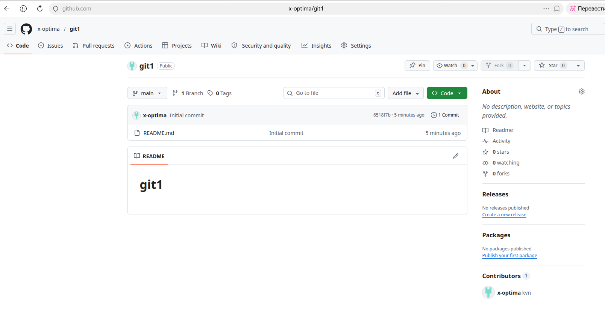
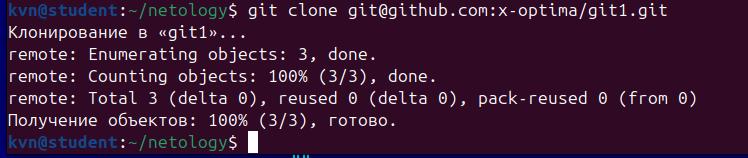
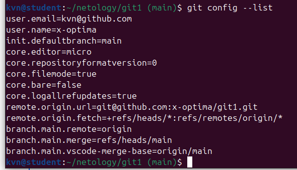
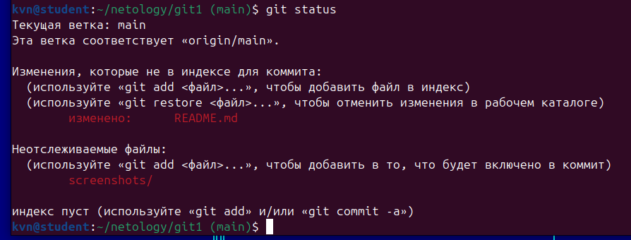
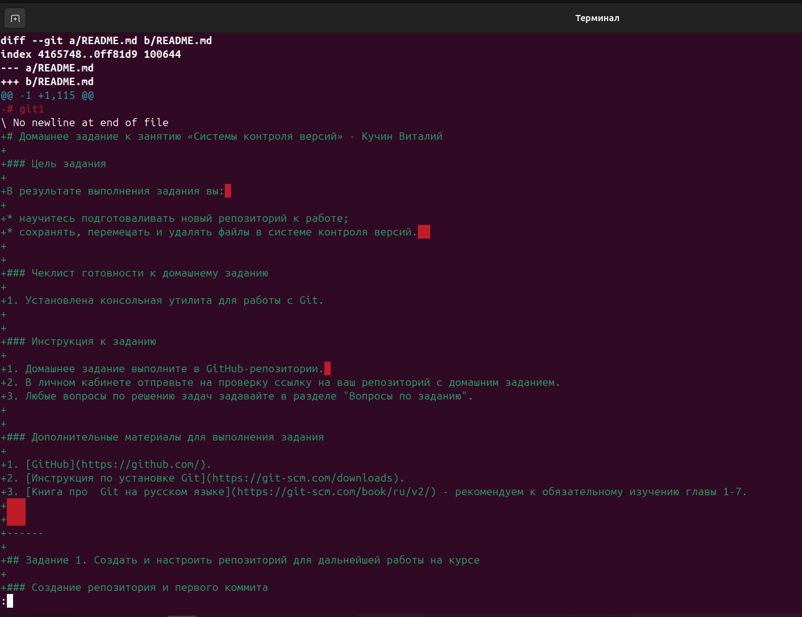
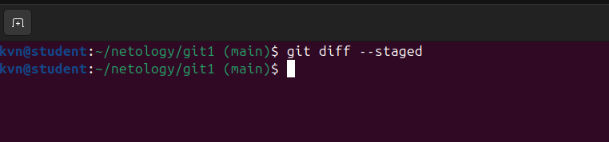
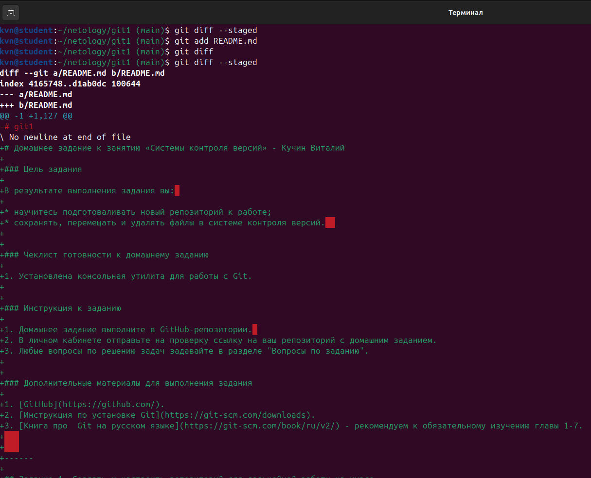

# Домашнее задание к занятию «Системы контроля версий» - Кучин Виталий

### Цель задания

В результате выполнения задания вы: 

* научитесь подготоваливать новый репозиторий к работе;
* сохранять, перемещать и удалять файлы в системе контроля версий.  

### Чеклист готовности к домашнему заданию

1. Установлена консольная утилита для работы с Git.

### Инструкция к заданию

1. Домашнее задание выполните в GitHub-репозитории. 
2. В личном кабинете отправьте на проверку ссылку на ваш репозиторий с домашним заданием.
3. Любые вопросы по решению задач задавайте в разделе "Вопросы по заданию".

### Дополнительные материалы для выполнения задания

1. [GitHub](https://github.com/).
2. [Инструкция по установке Git](https://git-scm.com/downloads).
3. [Книга про  Git на русском языке](https://git-scm.com/book/ru/v2/) - рекомендуем к обязательному изучению главы 1-7.
   
   
------

## Задание 1. Создать и настроить репозиторий для дальнейшей работы на курсе

### Создание репозитория и первого коммита

1. Создаём публичный репозиторий with a README.  

Скриншоты.  

    
2.Клонируем репозиторий, используя протокол SSH (`git clone ...`).
 
Скриншоты.  
  
    
 
3. Переходим в каталог с клоном репозитория и выводим на экран настройки  git.  

Скриншоты.  
  

4. Выполним команду `git status` и запомним результат. Видим что файл README.md уже и та изменён, а также изменена папка для скриншотов.  

Скриншоты.  
  

5. Выполним команды `git diff`

Скриншоты.  
  

и `git diff --staged`.

Скриншоты.  
  

6. Переведём файл в состояние `staged` (или, как говорят, просто добавьте файл в коммит) командой `git add README.md`.

Скриншоты.  
  

12. И ещё раз выполните команды `git diff` и `git diff --staged`. Поиграйте с изменениями и этими командами, чтобы чётко понять, что и когда они отображают. 
13. Теперь можно сделать коммит `git commit -m 'First commit'`.
14. И ещё раз посмотреть выводы команд `git status`, `git diff` и `git diff --staged`.

### Создание файлов `.gitignore` и второго коммита

1. Создайте файл `.gitignore` (обратите внимание на точку в начале файла), проверьте его статус сразу после создания. 
1. Добавьте файл `.gitignore` в следующий коммит (`git add...`).
1. На одном из следующих блоков вы будете изучать `Terraform`, давайте сразу создадим соотвествующий каталог `terraform` и внутри этого каталога — файл `.gitignore` по примеру: https://github.com/github/gitignore/blob/master/Terraform.gitignore.  
1. В файле `README.md` опишите своими словами, какие файлы будут проигнорированы в будущем благодаря добавленному `.gitignore`.
1. Закоммитьте все новые и изменённые файлы. Комментарий к коммиту должен быть `Added gitignore`.

### Эксперимент с удалением и перемещением файлов (третий и четвёртый коммит)

1. Создайте файлы `will_be_deleted.txt` (с текстом `will_be_deleted`) и `will_be_moved.txt` (с текстом `will_be_moved`) и закоммите их с комментарием `Prepare to delete and move`.
1. В случае необходимости обратитесь к [официальной документации](https://git-scm.com/book/ru/v2/Основы-Git-Запись-изменений-в-репозиторий) — здесь подробно описано, как выполнить следующие шаги. 
1. Удалите файл `will_be_deleted.txt` с диска и из репозитория. 
1. Переименуйте (переместите) файл `will_be_moved.txt` на диске и в репозитории, чтобы он стал называться `has_been_moved.txt`.
1. Закоммитьте результат работы с комментарием `Moved and deleted`.

### Проверка изменения

1. В результате предыдущих шагов в репозитории должно быть как минимум пять коммитов (если вы сделали ещё промежуточные — нет проблем):
    * `Initial Commit` — созданный GitHub при инициализации репозитория. 
    * `First commit` — созданный после изменения файла `README.md`.
    * `Added gitignore` — после добавления `.gitignore`.
    * `Prepare to delete and move` — после добавления двух временных файлов.
    * `Moved and deleted` — после удаления и перемещения временных файлов. 
2. Проверьте это, используя комманду `git log`. Подробно о формате вывода этой команды мы поговорим на следующем занятии, но посмотреть, что она отображает, можно уже сейчас.

### Отправка изменений в репозиторий

Выполните команду `git push`, если Git запросит логин и пароль — введите ваши логин и пароль от GitHub. 

В качестве результата отправьте ссылку на репозиторий. 

----

### Правила приёма домашнего задания

В личном кабинете отправлена ссылка на ваш репозиторий.

### Критерии оценки

Зачёт:

* выполнены все задания;
* ответы даны в развёрнутой форме;
* приложены соответствующие скриншоты и файлы проекта;
* в выполненных заданиях нет противоречий и нарушения логики.

На доработку:

* задание выполнено частично или не выполнено вообще;
* в логике выполнения заданий есть противоречия и существенные недостатки. 