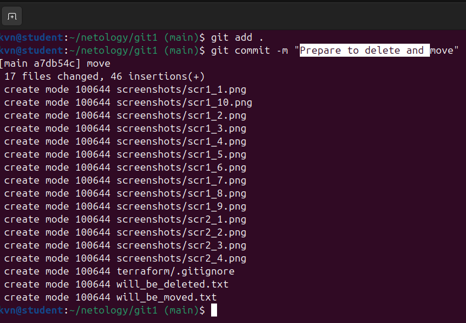
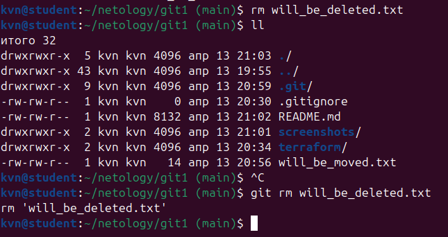
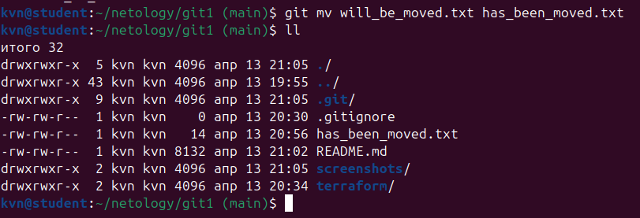
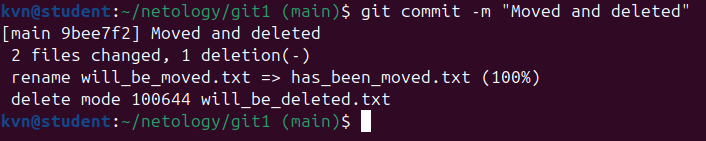
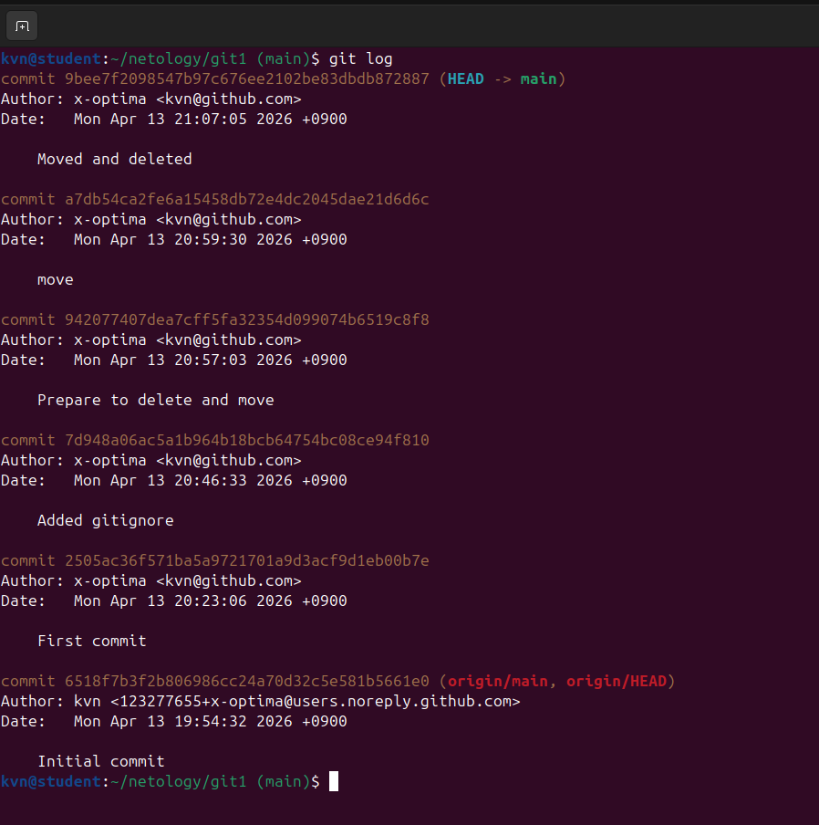
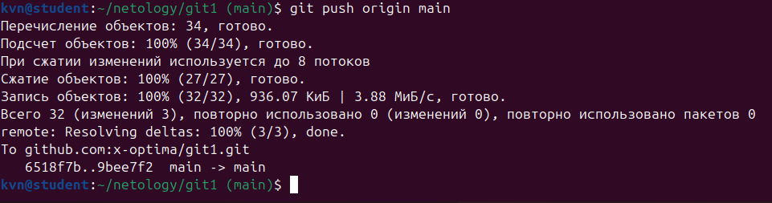

# Домашнее задание к занятию «Системы контроля версий» - Кучин Виталий

### Цель задания

В результате выполнения задания вы: 

* научитесь подготоваливать новый репозиторий к работе;
* сохранять, перемещать и удалять файлы в системе контроля версий.  

### Чеклист готовности к домашнему заданию

1. Установлена консольная утилита для работы с Git.

### Инструкция к заданию

1. Домашнее задание выполните в GitHub-репозитории. 
2. В личном кабинете отправьте на проверку ссылку на ваш репозиторий с домашним заданием.
3. Любые вопросы по решению задач задавайте в разделе "Вопросы по заданию".

### Дополнительные материалы для выполнения задания

1. [GitHub](https://github.com/).
2. [Инструкция по установке Git](https://git-scm.com/downloads).
3. [Книга про  Git на русском языке](https://git-scm.com/book/ru/v2/) - рекомендуем к обязательному изучению главы 1-7.
   
   
------

## Задание 1. Создать и настроить репозиторий для дальнейшей работы на курсе

### 1. Создание репозитория и первого коммита

1. Создаём публичный репозиторий with a README.  

Скриншоты.  

    
2.Клонируем репозиторий, используя протокол SSH (`git clone ...`).
 
Скриншоты.  
  
    
 
3. Переходим в каталог с клоном репозитория и выводим на экран настройки  git.  

Скриншоты.  
  

4. Выполним команду `git status` и запомним результат. Видим что файл README.md уже и та изменён, а также изменена папка для скриншотов.  

Скриншоты.  
  

5. Выполним команды `git diff`

Скриншоты.  
  

и `git diff --staged`.

Скриншоты.  
  

6. Переведём файл в состояние `staged` (или, как говорят, просто добавьте файл в коммит) командой `git add README.md`. И ещё раз выполните команды `git diff` и `git diff --staged`.  

Скриншоты.  
  

7. Cделаем коммит `git commit -m 'First commit'`.

Скриншоты.  
  

14. И ещё раз посмотреть выводы команд `git status`, `git diff` и `git diff --staged`.

Скриншоты.  
  
  

### 2. Создание файлов `.gitignore` и второго коммита

1. Создаём файл `.gitignore` и проверяем его статус сразу после создания.  

Скриншоты.  
  

2. Добавляем файл `.gitignore` в следующий коммит (`git add...`).  

Скриншоты.  
  

3. Создаём каталог `terraform` и внутри этого каталога — файл `.gitignore` с содержимым файла согласно ссылки "https://github.com/github/gitignore/blob/master/Terraform.gitignore."  

В будущем благодаря добавленному `.gitignore` будут проигнорированы файлы:    
- вся директория .terraform/ со всем содержимым (локальные модули, кэш, плагины и т.д.)  
- файлы .tfstate и все варианты вида *.tfstate, *.tfstate.* (состояние инфраструктуры).  
- файлы крэш‑логов: crash.log, crash.*.log.  
- файлы переменных: *.tfvars, *.tfvars.json (обычно в них лежат секреты и чувствительные данные).  

**Override‑файлы:** override.tf, override.tf.json *_override.tf, *_override.tf.json  
**Файл блокировки состояния:** .terraform.tfstate.lock.info.  
**Файл настроек клиента Terraform:** .terraformrc, terraform.rc (локальные конфиги).  

## <h2 style="color:red;">ДОРАБОТКА</h2> ##
### ***От Филиппа Воронова ***  
Здравствуйте, спасибо за присланное дз!  
В ридми следует описать файлы какого вида будут игнорироваться в терраформовском гитигноре, расшифровав язык правил гитигнора (о роли файлов в терраформе писать не надо); например:  
будут игнорироваться все файлы в имени которых есть буквосочетание IGNORE  

## ОТВЕТ ##

**Правила шаблонов .gitignore**  

Пустые строки, а также строки, начинающиеся с #, игнорируются  
Стандартные шаблоны являются глобальными и применяются  
рекурсивно для всего дерева каталогов  
Чтобы избежать рекурсии, используйте символ слеш (/) в начале шаблона  
Чтобы исключить каталог, добавьте слеш (/) в конец шаблона  
Можно инвертировать шаблон, использовав восклицательный знак  
(!) в качестве первого символа  
Символ (*) соответствует 0 или более символам  

**/.terraform/* — будут игнорироваться все файлы и папки внутри каталогов с именем .terraform на любом уровне вложенности.

*.tfstate — будут игнорироваться все файлы с расширением .tfstate в любом месте проекта.

*.tfstate.* — будут игнорироваться все файлы, имя которых начинается с .tfstate и дальше содержит любое расширение или суффикс.

crash.log — будет игнорироваться файл с точным именем crash.log в любой директории.

crash.*.log — будут игнорироваться файлы, имя которых начинается с crash., затем идёт любая последовательность символов, и заканчивается на .log.

*.tfvars — будут игнорироваться все файлы с расширением .tfvars в любом месте проекта.

*.tfvars.json — будут игнорироваться все файлы с окончанием .tfvars.json.

override.tf — будет игнорироваться файл с точным именем override.tf.

override.tf.json — будет игнорироваться файл с точным именем override.tf.json.

*_override.tf — будут игнорироваться все файлы, имя которых заканчивается на _override.tf, а перед этим может быть любая последовательность символов.

*_override.tf.json — будут игнорироваться все файлы, имя которых заканчивается на _override.tf.json.

.terraform.tfstate.lock.info — будет игнорироваться файл с точным именем .terraform.tfstate.lock.info.

\# !example_override.tf — это пример исключения: строка с ! означает, что файл можно вернуть из игнорирования.

*tfplan* — будут игнорироваться все файлы, в имени которых встречается tfplan.

.terraformrc — будет игнорироваться файл с точным именем .terraformrc.

terraform.rc — будет игнорироваться файл с точным именем terraform.rc.

*.dot — будут игнорироваться все файлы с расширением .dot.

planout — будет игнорироваться файл или путь с именем planout.

Скриншоты.  
  

4. Коммитим все новые и изменённые файлы. Комментарий к коммиту `Added gitignore`.  

Скриншоты.  
  

### 3. Эксперимент с удалением и перемещением файлов (третий и четвёртый коммит)

1. Создаем файлы `will_be_deleted.txt` (с текстом `will_be_deleted`) и `will_be_moved.txt` (с текстом `will_be_moved`) и закоммитим их с комментарием `Prepare to delete and move`.

Скриншоты.  
   

2. Удаляем файл `will_be_deleted.txt` с диска и из репозитория.  

Скриншоты.  
  

3. Переименуем (переместим) файл `will_be_moved.txt` на диске и в репозитории, чтобы он стал называться `has_been_moved.txt`.  

Скриншоты.  
  

4. Закоммитим результат работы с комментарием `Moved and deleted`.

Скриншоты.  
  

### 4. Проверка изменения

1. Проверяем количество коомитов командой `git log`. Их получилось шесть.  

Скриншоты.  
  

### 5.Отправка изменений в репозиторий

1. Выполним команду `git push`,

Скриншоты.  
  

