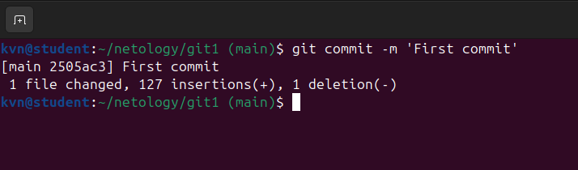
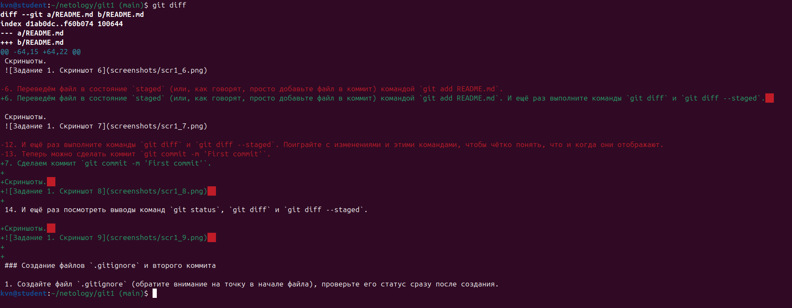
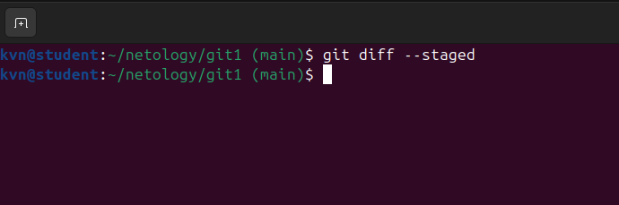
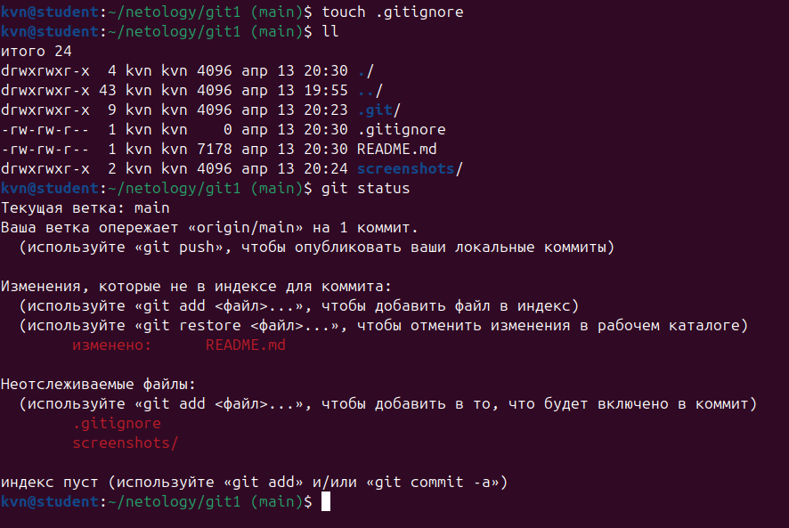
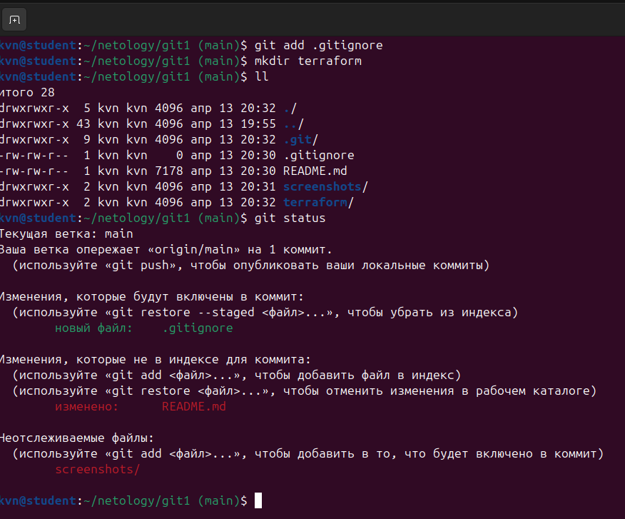
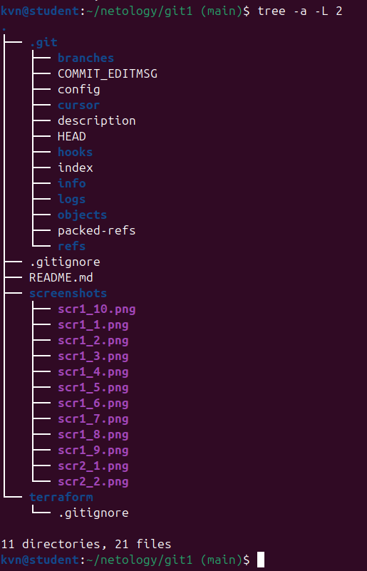
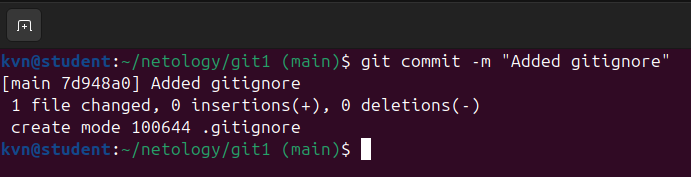

# Домашнее задание к занятию «Системы контроля версий» - Кучин Виталий

### Цель задания

В результате выполнения задания вы: 

* научитесь подготоваливать новый репозиторий к работе;
* сохранять, перемещать и удалять файлы в системе контроля версий.  

### Чеклист готовности к домашнему заданию

1. Установлена консольная утилита для работы с Git.

### Инструкция к заданию

1. Домашнее задание выполните в GitHub-репозитории. 
2. В личном кабинете отправьте на проверку ссылку на ваш репозиторий с домашним заданием.
3. Любые вопросы по решению задач задавайте в разделе "Вопросы по заданию".

### Дополнительные материалы для выполнения задания

1. [GitHub](https://github.com/).
2. [Инструкция по установке Git](https://git-scm.com/downloads).
3. [Книга про  Git на русском языке](https://git-scm.com/book/ru/v2/) - рекомендуем к обязательному изучению главы 1-7.
   
   
------

## Задание 1. Создать и настроить репозиторий для дальнейшей работы на курсе

### 1. Создание репозитория и первого коммита

1. Создаём публичный репозиторий with a README.  

Скриншоты.  

    
2.Клонируем репозиторий, используя протокол SSH (`git clone ...`).
 
Скриншоты.  
  
    
 
3. Переходим в каталог с клоном репозитория и выводим на экран настройки  git.  

Скриншоты.  
  

4. Выполним команду `git status` и запомним результат. Видим что файл README.md уже и та изменён, а также изменена папка для скриншотов.  

Скриншоты.  
  

5. Выполним команды `git diff`

Скриншоты.  
  

и `git diff --staged`.

Скриншоты.  
  

6. Переведём файл в состояние `staged` (или, как говорят, просто добавьте файл в коммит) командой `git add README.md`. И ещё раз выполните команды `git diff` и `git diff --staged`.  

Скриншоты.  
  

7. Cделаем коммит `git commit -m 'First commit'`.

Скриншоты.  
  

14. И ещё раз посмотреть выводы команд `git status`, `git diff` и `git diff --staged`.

Скриншоты.  
  
  

### 2. Создание файлов `.gitignore` и второго коммита

1. Создаём файл `.gitignore` и проверяем его статус сразу после создания.  

Скриншоты.  
  

2. Добавляем файл `.gitignore` в следующий коммит (`git add...`).  

Скриншоты.  
  

3. Создаём каталог `terraform` и внутри этого каталога — файл `.gitignore` с содержимым файла согласно ссылки "https://github.com/github/gitignore/blob/master/Terraform.gitignore."  

В будущем благодаря добавленному `.gitignore` будут проигнорированы файлы:    
- вся директория .terraform/ со всем содержимым (локальные модули, кэш, плагины и т.д.)  
- файлы .tfstate и все варианты вида *.tfstate, *.tfstate.* (состояние инфраструктуры).  
- файлы крэш‑логов: crash.log, crash.*.log.  
- файлы переменных: *.tfvars, *.tfvars.json (обычно в них лежат секреты и чувствительные данные).  

**Override‑файлы:** override.tf, override.tf.json *_override.tf, *_override.tf.json  
**Файл блокировки состояния:** .terraform.tfstate.lock.info.  
**Файл настроек клиента Terraform:** .terraformrc, terraform.rc (локальные конфиги).  

Скриншоты.  
  

4. Коммитим все новые и изменённые файлы. Комментарий к коммиту `Added gitignore`.  

Скриншоты.  
  

### Эксперимент с удалением и перемещением файлов (третий и четвёртый коммит)

1. Создайте файлы `will_be_deleted.txt` (с текстом `will_be_deleted`) и `will_be_moved.txt` (с текстом `will_be_moved`) и закоммите их с комментарием `Prepare to delete and move`.
1. В случае необходимости обратитесь к [официальной документации](https://git-scm.com/book/ru/v2/Основы-Git-Запись-изменений-в-репозиторий) — здесь подробно описано, как выполнить следующие шаги. 
1. Удалите файл `will_be_deleted.txt` с диска и из репозитория. 
1. Переименуйте (переместите) файл `will_be_moved.txt` на диске и в репозитории, чтобы он стал называться `has_been_moved.txt`.
1. Закоммитьте результат работы с комментарием `Moved and deleted`.

### Проверка изменения

1. В результате предыдущих шагов в репозитории должно быть как минимум пять коммитов (если вы сделали ещё промежуточные — нет проблем):
    * `Initial Commit` — созданный GitHub при инициализации репозитория. 
    * `First commit` — созданный после изменения файла `README.md`.
    * `Added gitignore` — после добавления `.gitignore`.
    * `Prepare to delete and move` — после добавления двух временных файлов.
    * `Moved and deleted` — после удаления и перемещения временных файлов. 
2. Проверьте это, используя комманду `git log`. Подробно о формате вывода этой команды мы поговорим на следующем занятии, но посмотреть, что она отображает, можно уже сейчас.

### Отправка изменений в репозиторий

Выполните команду `git push`, если Git запросит логин и пароль — введите ваши логин и пароль от GitHub. 

